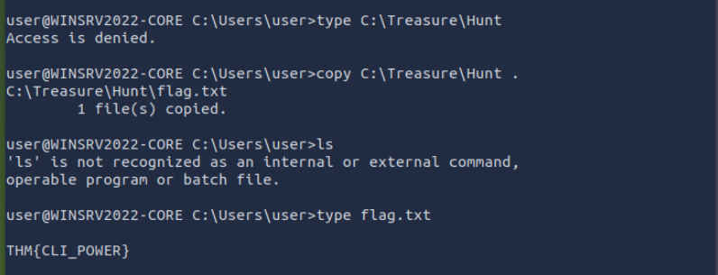

# General tips & tricks for CTFs

A file can have broken permissions. Copying the contents can reveal the flag.

What are the file’s contents in C:\Treasure\Hunt?



----------------------------------------------------

[Hacker101 CTF notes](https://github.com/e2f5db0/ctf-notes-hacker101)

----------------------------------------------------

A bash script for searching /var/log for THM flags:

```bash
#!/bin/bash
directory="/var/log"

flag="THM{"

echo "Flag search in directory: $directory in progress..."

for file in "$directory"/*.log; do
    # Check if the file contains a THM flag
    if grep -1 "$flag" "$file"; then
        echo "Flag found in: $(basename "$file")"
    if
done
```

---------------------------------------------------

CTF tools:

- RsaCtfTool (https://github.com/RsaCtfTool/RsaCtfTool)
- rsatool (https://github.com/ius/rsatool)