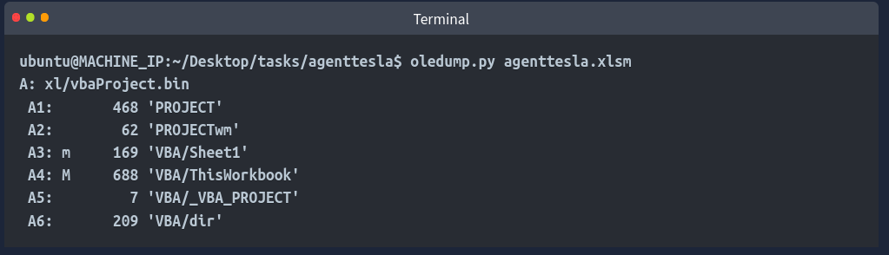

# Notes on Digital Forensics and Incident Response

Resources

- [auditd rules](https://github.com/Neo23x0/auditd/blob/master/audit.rules)
- [URLScan](https://urlscan.io/) – URL sandbox
- [URL2PNG](https://www.url2png.com/) – URL sandbox
- [Wannabrowser](https://www.wannabrowser.net/) – URL sandbox
- [Link Reputation – Talos](https://talosintelligence.com/reputation)
- [File Reputation – Talos](https://talosintelligence.com/talos_file_reputation)
- [VirusTotal](https://www.virustotal.com/) – malware hash lookups
- [ThreatBook](https://threatbook.io/) – Threat Intelligence Lookup for URLs
- [AbuseIPDB](https://www.abuseipdb.com) – open-source database for known malicious IPs
- [Metadefender OPSWAT](https://metadefender.opswat.com) – malware hash lookups
- [TrueURL] – https://trueurl.com/ – Check URL Redirects
- [Email header analysis tool](https://mha.azurewebsites.net/)
- [EML Analyzer](https://eml-analyzer.herokuapp.com/)
- [SPF Surveyor](https://dmarcian.com/spf-survey/)
- [Malware Bazaar](https://bazaar.abuse.ch/)
- [SOC Prime Threat Detection Marketplace](https://tdm.socprime.com/)
- [SSDeep Fuzzy Hashing](https://ssdeep-project.github.io/ssdeep/index.html) – match two files with minor differences
- [Any.Run](https://app.any.run/)
- [Hybrid Analysis](https://www.hybrid-analysis.com/) – Malware analysis service
- [JoeSecurity](https://www.joesecurity.org/) – Malware analysis service

### Disk images

- FTK Imager – disk images of Windows operating systems
- [Autopsy](https://www.autopsy.com/) – open-source digital forensics platform, conduct an extensive analysis of an image
- [DumpIt](https://www.toolwar.com/2014/01/dumpit-memory-dump-tools.html) – for taking a memory image from a Windows OS
- [Volatility](https://volatilityfoundation.org/) – open-source tool for analyzing memory images
- Rekall - Framework for memory forensics in incident response.

### Windows logs & Event Viewer

Windows logs (.evtx – binary format) are stored at: 
`C:\Windows\System32\winevt\Logs`

Event Viewer IDs:

`Win + R` --> `eventvwr`

| Event ID | Description | Sub-fields |
| -------- | ----------- | ---------- |
| 4624     | User account successfully logged in | Logon Type: 10 = RDP, 3 = Network |
| 4625     | User account failed to login | - |
| 4634     | User account successfully logged off | - |
| 4697     | Service was created | - |
| 4698     | Scheduled task was created | - |
| 4720     | User account was created | - |
| 4722     | User changed their password | - |
| 4723     | User account was enabled | - |
| 4724     | Attempt was made to reset an account’s password | - |
| 4725     | User account was disabled | - |
| 4726     | User account was deleted | - |
| 4732     | User was added to a security group | - |
| 4733     | User was removed from a security group | - |
| 4738     | User account was changed | - |
| 104      | Event log was cleared | - |

Event ID 2624 (Successull logins) have a Logon ID which is a unique session identifier. Save it for further analysis.

#### Sysmon

Once installed, sysmon logs can be found in Event Viewer under `Applications & Services Logs -> Microsoft -> Windows -> Sysmon -> Operational` 

| Event ID | Description |
| -------- | ----------- |
| 1        | Process creation |

#### Powershell history

Poweshell history file location:

`C:\Users\<USER>\AppData\Roaming\Microsoft\Windows\PowerShell\PSReadline\ConsoleHost_history.txt`

### Linux logs

Bash commands with a leading space will not be included in .bash_history. Shells such as /bin/sh do not save history at all.

#### auditd

`/var/log/audit/audit.log` is easier to read via the `ausearch` command.

`ausearch -i -k proc_wget` would filter logs that match the key "proc_wget" set in the `/etc/audit/rules.d/` rules.

`ausearch -i -x whoami` – filters the results by the command name whoami

`ausearch -i -x nohup` – filters the results by the command nohup which allows processes to continue running after the attacker's ssh session is closed

`ausearch -i --pid 3095` – useful for creating process trees from parent process IDs

`ausearch -i --ppid 3898 | grep proctitle` – list child processes of a parent process, filter the command line

`ausearch -i -f /etc/systemd` – look for changes to the /etc/systemd file

Look for changes to these files to detect persistence

cron:

- /etc/crontab
- /etc/cron.d*
- /var/spool/cron/*
- /var/spool/crontab/*

systemd:

- /etc/systemd/system/*
- /lib/systemd/system/*
- /usr/lib/systemd/system/*
- /run/systemd/system/*
- /usr/local/lib/systemd/system/*
- /etc/systemd/system.control/*
- /run/systemd/system.control/*
- /run/systemd/transient/*
- /run/systemd/generator.early/*
- /etc/systemd/system.attached/*
- /run/systemd/system.attached/*
- /run/systemd/generator/*
- /run/systemd/generator.late/*

Alternatives to auditd:

- [Sysmon for Linux](https://github.com/microsoft/SysmonForLinux)
- [Falco](https://falco.org/) – modern, FOSS, for containerized systems
- [osquery](https://osquery.io/) – SQL-like usage

#### Log handling:

Let's say we have a firewall log like so:

```bash
head firewall.log
# 2025-08-25 00:47:46 ALLOW TCP 198.51.100.77:60317 -> 10.0.0.50:443
# 2025-08-25 01:29:33 ALLOW TCP 203.0.113.100:62718 -> 10.0.0.60:443
# 2025-08-25 01:42:12 ALLOW TCP 203.0.113.100:55875 -> 10.0.0.51:80
# 2025-08-25 03:30:47 ALLOW TCP 198.51.100.77:63035 -> 10.0.0.20:80
# 2025-08-25 04:06:58 ALLOW TCP 192.0.2.115:65458 -> 10.0.0.20:25
```

We can isolate particular fields by splitting every " ":

```bash
# -f5: select the fifth field after splitting
# sort -nr: sort numerically reversed
# uniq -c: count unique fields (IPs in this case)
cat firewall.log | grep "BLOCK" | cut -d " " -f5 | cut -d: -f1 | sort -nr | uniq -c
```

If a log file is unsanitized & without clear columns, it's a good idea to `cut` the file into columns using a delimiter found in the file:

```bash
# cut the csv log file into six columns using "," as the delimiter
cat log-session-1.csv | cut -d "," -f1,2,3,4,5,6
```

General Linux log file locations:

- /var/log/httpd: Contains HTTP Request  / Response and error logs.
- /var/log/cron: Events related to cron jobs are stored in this location.
- /var/log/auth.log and /var/log/secure: Stores authentication-related logs.
- /var/log/kern: This file stores kernel-related events.

## Malware analysis / Reversing / Debugging

- [REMnux VM](https://remnux.org/) – A linux toolkit for malware analysis
- FlareVM – has most of the tools listed below

### Static analysis

- [CAPA](https://github.com/mandiant/capa) – detects capabilities in executable files (open-source)
- [CAPA analysis web explorer](https://mandiant.github.io/capa/explorer/#/)
- [Javascript Obfuscator](https://codebeautify.org/javascript-obfuscator)
- [Javascript Deobfuscator](https://obf-io.deobfuscate.io/)
- [CyberChef](https://gchq.github.io/CyberChef/)
- Ghidra - NSA-developed open-source reverse engineering suite.
- x64dbg - Open-source debugger for binaries in x64 and x32 formats.
- OllyDbg - Debugger for reverse engineering at the assembly level.
- Radare2 - A sophisticated open-source platform for reverse engineering.
- Binary Ninja - A tool for disassembling and decompiling binaries.
- PEiD - Packer, cryptor, and compiler detection tool.
- PEStudio – study executable file properties

#### Disassemblers & Decompilers

- CFF Explorer - A PE editor designed to analyze and edit Portable Executable (PE) files.
- Hopper Disassembler - A Debugger, disassembler, and decompiler.
- RetDec - Open-source decompiler for machine code.

#### File Analysis

- FileInsight - A program for looking through and editing binary files.
- Hex Fiend - Hex editor that is light and quick.
- HxD - Binary file viewing and editing with a hex editor.


#### Oledump.py

```bash
# list data streams of a file
# streams might contain embedded scripts
$ oledump.py <filepath>
```

The M in the following example output means there is a macro in the stream number 4:



```bash
# select the 4th data stream
# auto-decompress any VBA macros into a more readable format
oledump.py agenttesla.xlsm -s 4 --vbadecompress
```

Oledump outputs the script which can then be analyzed further using CyberChef for example.

#### Volatility (windows plugins)

```bash
# basic usage
$ vol3 -f memory_image_file.mem

# list processes in a tree
$ vol3 -f memory_image_file.mem windows.pstree.PsTree

# list all curently active processes in the machine
$ vol3 -f memory_image_file.mem windows.pslist.PsList

# list process command line arguments
$ vol3 -f memory_image_file.mem windows.cmdline.CmdLine

# scan for file objects
# the output can be huge
$ vol3 -f memory_image_file.mem windows.filescan.FileScan

# list loaded modules (dll)
$ vol3 -f memory_image_file.mem windows.dlllist.DllList

# scan for processes
$ vol3 -f memory_image_file.mem windows.psscan.PsScan

# list memory ranges that potentially contain injected code
$ vol3 -f memory_image_file.mem windows.malfind.Malfind
```

```bash
# loop all of the above into text files in -q quiet mode (no terminal output)
# replace IMAGE_FILE and FILENAME
for plugin in windows.malfind.Malfind windows.psscan.PsScan windows.pstree.PsTree windows.pslist.PsList windows.cmdline.CmdLine windows.filescan.FileScan windows.dlllist.DllList; do vol3 -q -f IMAGE_FILE.mem $plugin > FILENAME.$plugin.txt; done
```

```bash
# preprocess the memory image for analysis with the strings utility
# extract printable ASCII text
strings IMAGE_FILE.mem > IMAGE_FILE.strings.ascii.txt
# ASCII 16-bit little-endian
strings -e l IMAGE_FILE.mem > IMAGE_FILE.strings.ascii.txt
# ASCII 16-bit big-endian
strings -e b IMAGE_FILE.mem > IMAGE_FILE.strings.ascii.txt
```

### Dynamic Analysis

- Process Hacker - Sophisticated memory editor and process watcher.
- PEview - A portable executable (PE) file viewer for analysis.
- Dependency Walker - A tool for displaying an executable’s DLL dependencies.
- DIE (Detect It Easy) - A packer, compiler, and cryptor detection tool.
- Process Monitor (procmon) – See how executables behave in the system

#### INetSim

Internet Services Simulation Suite that can be used to analyze the network traffic a malicious software tries to generate.

The config file is located in /etc/inetsim/inetsim.conf

```bash
# inetsim will generate a report in /var/log/inetsim/report after stopping the simulation
sudo inetsim
```

## Network analysis

If you can detect the custom User-Agent strings that the attacker is using, you might be able to block them, creating more obstacles and making their attempt to compromise the network more annoying.

### tshark

```bash
# Filter out the User-Agent strings from HTTP requests.
# 
tshark --Y http.request -T fields -e http.host -e http.user_agent -r analysis_file.pcap
```

### Wireshark

`Ctrl + Alt + 1` – Display timestamps in UTC format in pcap files

Filter `_ws.col.info contains "keyword"` to refer to the info column 